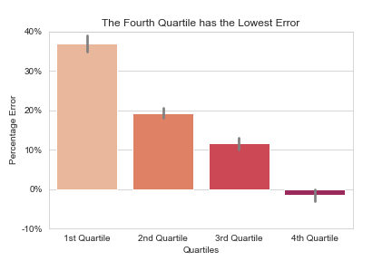
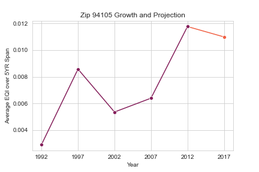

capstone-02
==============================

Capstone for Springboard DS track: Prediction of future growth of entrepreneurial environments by zip code.

Project Organization
------------

    ├── LICENSE
    ├── Makefile           <- Makefile with commands like `make data` or `make train`
    ├── README.md          <- The top-level README for developers using this project.
    ├── data
    │   ├── external       <- Data from third party sources.
    │   ├── interim        <- Intermediate data that has been transformed.
    │   ├── processed      <- The final, canonical data sets for modeling.
    │   └── raw            <- The original, immutable data dump.
    │
    ├── docs               <- A default Sphinx project; see sphinx-doc.org for details
    │
    ├── models             <- Trained and serialized models, model predictions, or model summaries
    │
    ├── notebooks          <- Jupyter notebooks. Naming convention is a number (for ordering),
    │                         the creator's initials, and a short `-` delimited description, e.g.
    │                         `1.0-jqp-initial-data-exploration`.
    │   └── eda            <- Interactive notebooks for all data generated by Pandas Profiling
    │
    ├── references         <- Data dictionaries, manuals, and all other explanatory materials.
    │
    ├── reports            <- Generated analysis as HTML, PDF, LaTeX, etc.
    │   └── figures        <- Generated graphics and figures to be used in reporting
    │
    ├── requirements.txt   <- The requirements file for reproducing the analysis environment, e.g.
    │                         generated with `pip freeze > requirements.txt`
    │
    ├── setup.py           <- makes project pip installable (pip install -e .) so src can be imported
    ├── src                <- Source code for use in this project.
    │   ├── __init__.py    <- Makes src a Python module
    │   │
    │   ├── data           <- Scripts to download or generate data
    │   │   └── make_dataset.py
    │   │
    │   ├── features       <- Scripts to turn raw data into features for modeling
    │   │   └── build_features.py
    │   │
    │   ├── models         <- Scripts to train models and then use trained models to make
    │   │   │                 predictions
    │   │   ├── predict_model.py
    │   │   └── train_model.py
    │   │
    │   └── visualization  <- Scripts to create exploratory and results oriented visualizations
    │       └── visualize.py
    │
    └── tox.ini            <- tox file with settings for running tox; see tox.readthedocs.io

--------

## The Data
The data was gathered from three separate datasets of the Startup Cartography Project. The datasets correspond to yearly 
measurements at the Zip Code, Metropolitan Statistical Area, and State geographic regions. Three measures of entreprneurial
quality are provided; EQI, SFR and RECPI. The predictions were performed on a mean aggregation of the EQI over a 5 year span, 
for a specific zipcode.

## The Method
1. Match zip data with corresponding MSA and state level data.
1. Transform data from yearly rows to 5-year-increment rows.
1. Perform aggregation functions on dataset leading to highly correlated features.
1. Drop low correlation features.
1. Perform clustering on dataset using KNN cluster algorithm.
1. One-hot-encode and scale data.
1. Perform evaluative modeling, choosing top three performing models.
1. Perform hyperparameter tuning on top three models using bayesian search of parameter grid.

## Feature Engineering

Features were added to aid in model training. They include:

- Mean aggregation of EQI over 5 year period
- Mean aggregation of RECPI over 5 year period
- First difference between years of EQI at the zip level
- First difference between years of RECPI at the zip level
- KNN clusters across subsets of features

Algorithms and Machine Learning
------------

Various models were trained with their base parameters in order to choose
three models for hyperparameter tuning. Their performances are evaluated below
using the R2 metric.

| Model      | R2 Score |
| ----------- | ----------- |
| OLS | 48% |
| Ridge   | 48% |
| Lasso   | < 0% |
| <b>KNN</b> | <b>63%</b> |
| SVM   | < 0% |
| <b>Random Forest</b> | <b>92%</b> |
| <b>Gradient Boost</b> | <b>73%</b> |
| AdaBoost | < 0% |
| Tree Bagging | 87% |
| MLP | < 0% |

The KNN Regressor, Random Forest Regressor, and Gradient Boost Regressor were chosen for 
parameter tuning based upon performance in the model evaluation step. They were tuned using
bayesian search on their respective parameter grids, and then evaluated on the holdout dataset.
Their respective performances are below.

| Model      | R2 Score |
| ----------- | ----------- |
| KNN | 52.8% |
| <b>Random Forest</b> | <b>60.4%</b> |
| Gradient Boost | 12.6% |

Best Metrics
------------

These are the best parameter metrics found by completing hyperparameter tuning.

| Parameter | Value |
| ----------- | ----------- |
| model | Random Forest Regressor |
| n_estimators | 315 |
| max_features | sqrt |
| max_depth | 72 |
| min_samples_split | 2 |
| min_samples_leaf | 4 |
| bootstrap | False |

Model Evaluation
------------

The model achieved a <b>60.4% R2 error</b>, but that is not the only metric of 
how the model is performing. Percent error by quartiles of the data are visualized below, 
with the fourth quartile corresponding to the highest growth areas.

The figure below displays the spread of actual vs predicted values. The fourth quartile 
has greater distribution than the previous three quartiles.

The model's purpose is to evaluate future entrepenruial growth in a defined
area, so a zip was chosen from the dataset and used to project growth over the next
5 year span.

Future Improvements
------------

Future improvements can be accomplished both on the data and modeling sides
of the problem. 

On the data side, more variation in data can be gathered to give
the model a more complete picture of entrepreneurial activity. This could include data
about the region's economy, or could include demographic information.

On the modeling side, further feature engineering could provide a bump in score.
Additionally, the model could be chained with a regressor to smooth predictions.

Credits
------------

Thank you to Moe Bataineh for his continued support as I progress in learning Data Science.

Thank you to the people of the Startup Cartography Project for providing their awesome dataset!

<small>Project based on the <a target="_blank" href="https://drivendata.github.io/cookiecutter-data-science/">cookiecutter data science project template</a>. #cookiecutterdatascience</small>

